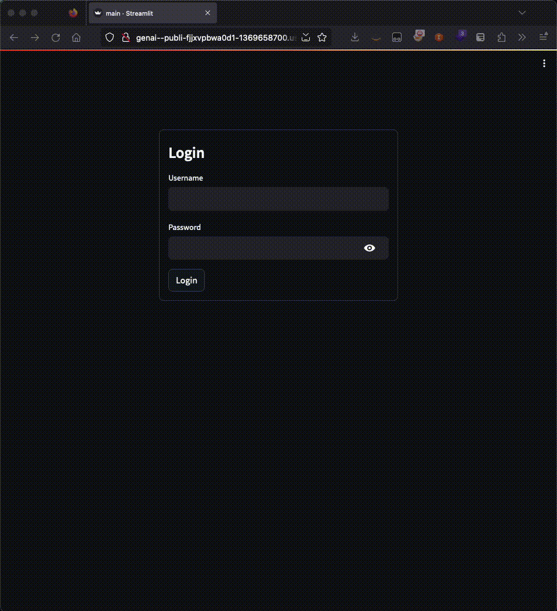
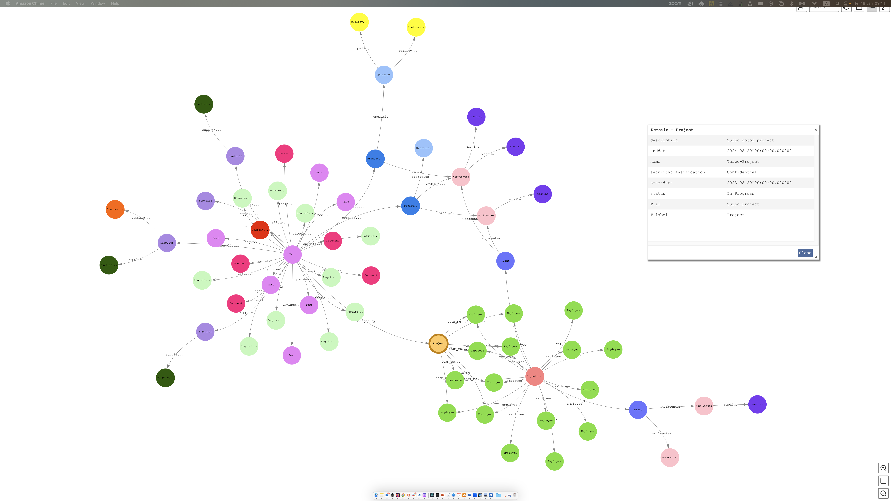
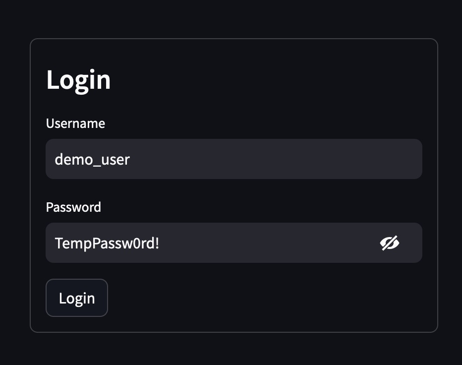
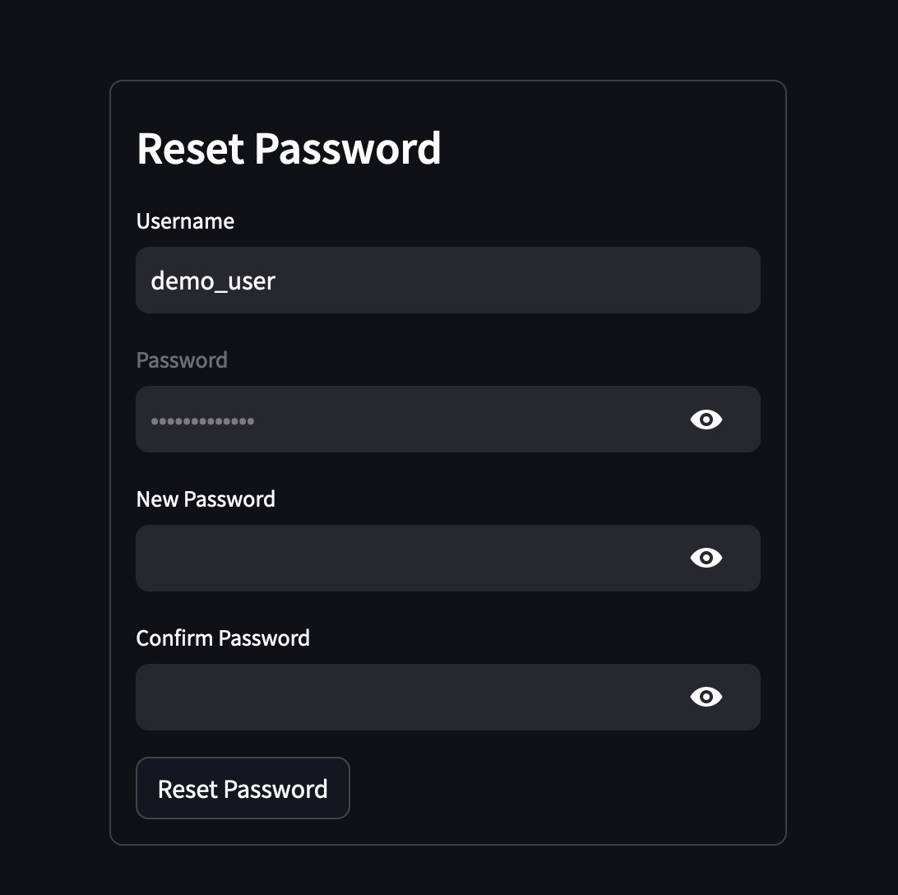
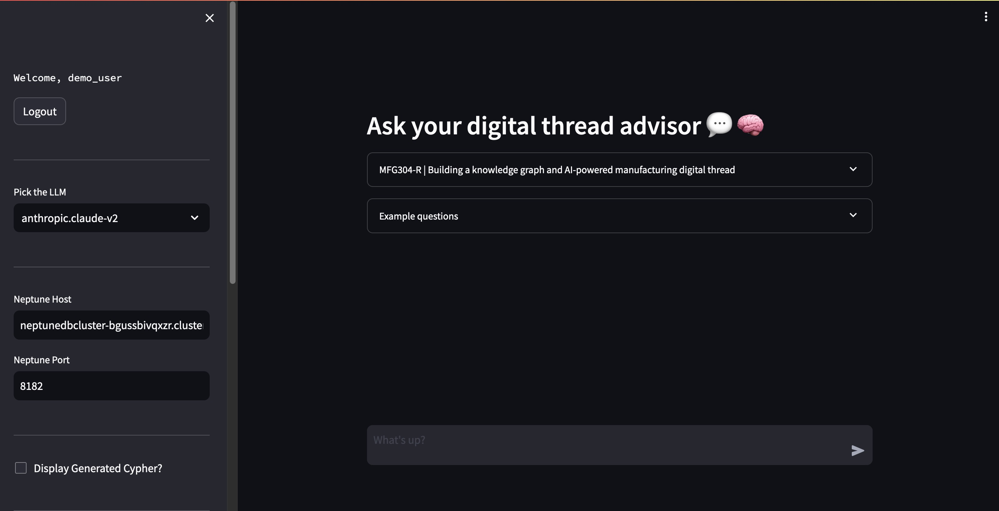
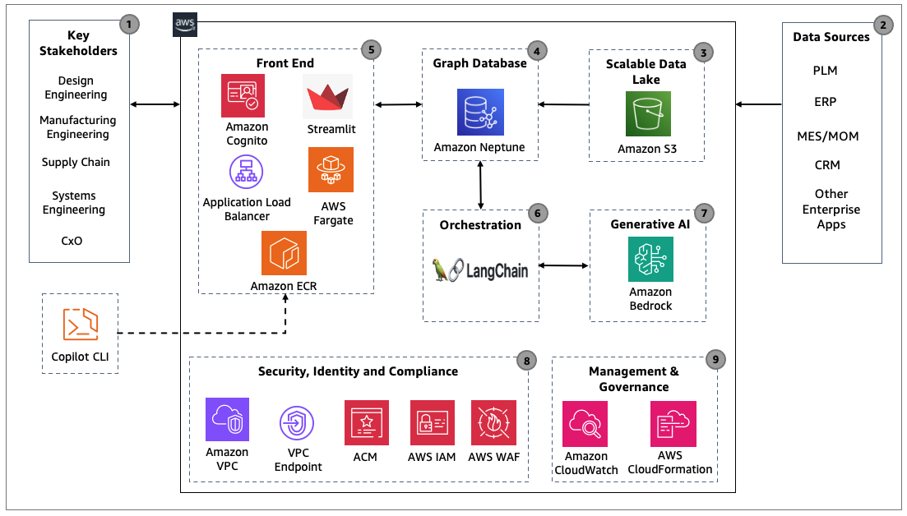

# Building Manufacturing Digital Thread Using Graph and Generative AI on AWS

## Table of Contents
1. [Introduction](#introduction)
2. [Prerequisites](#prerequisites)
3. [Deployment](#deployment)
4. [Data import](#data-import)
5. [Application User Guide](#application-user-guide)
6. [Cleaning up](#cleaning-up)
7. [Architecture Diagram](#architecture-diagram)
8. [Security](#security)
9. [AWS Guidance](#aws-guidance)
10. [Blog](#blog)
11. [Contributors](#contributors)
12. [FAQ](#faq)
13. [License](#license)


## Introduction

Manufacturing organizations have vast amounts of knowledge dispersed across the product lifecycle, which can result in limited visibility, knowledge gaps, and the inability to continuously improve. A digital thread offers an integrated approach to combine disparate data sources across enterprise systems to drive traceability, accessibility, collaboration, and agility. 

In this sample project, learn how to create an intelligent manufacturing digital thread using a combination of knowledge graph and generative AI technologies based on data generated throughout the product lifecycle, and their interconnected relationship. Explore use cases and discover actionable steps to start your intelligent digital thread journey using graph and generative AI on AWS.

 

## Prerequisites

To execute the steps outlined in this post, you will require the following:

* An AWS account – [how to create a new AWS account](https://aws.amazon.com/premiumsupport/knowledge-center/create-and-activate-aws-account/)
* Access Anthropic Claude-v2 model in Amazon Bedrock - [how to manage model access in Amazon Bedrock](https://docs.aws.amazon.com/bedrock/latest/userguide/model-access.html)
* Create and configure the local environment
    * [Configure AWS credentials](https://aws.github.io/copilot-cli/docs/credentials/)
    * [Install AWS Copilot](https://aws.github.io/copilot-cli/docs/getting-started/install/)
    * [Install and run Docker](https://www.docker.com/get-started/)
    * [Install jq](https://jqlang.github.io/jq/download/)
* Ensure you have enough capacity for the creation of 3 Elastic IP's.

## Deployment

1. Clone the repository into your environment
    ```
    git clone https://github.com/aws-samples/genai-mfg-digitalthread-with-neptune-kg.git
    cd genai-mfg-digitalthread-with-neptune-kg
    ```

2. To deploy this app, run:

    ```
    chmod +x deploy-script.sh
    ./deploy-script.sh
    ```

    > The deploy-script.sh will set up the following resources in your account:
    > * Amazon Cognito User pool with a demo user account
    > * Amazon Neptune Serverless cluster
    > * Amazon Neptune workbench Sagemaker notebook
    > * A VPC
    > * Subnets/Security Groups
    > * Application Load Balancer
    > * Amazon ECR Repository
    > * ECS Cluster & Service running on AWS Fargate

    In case if you are asked about the AWS credentials as shown below. Please read [Configure AWS credentials](https://aws.github.io/copilot-cli/docs/credentials/).
    ```
    Which credentials would you like to use to create demo?  [Use arrows to move, type to filter, ? for more help]
      > Enter temporary credentials
        [profile default]
    ```

3. Visit the URL after AWS Copilot deployment to chat with the digital thread.
    ```
    ✔ Deployed service genai-chatbot-app.
    Recommended follow-up action:
    - Your service is accessible at http://genai--Publi-xxxxxxx-111111111.xx-xxxx-x.elb.amazonaws.com over the internet.
    ```

## Data import

Newly deployed Amazon Neptune clusters does not contain any data. To showcase the interaction between Amazon Bedrock Gen AI and Neptune knowledge graph based Digital Thread, please follow the below steps to import the sample data from [src/knowledge-graph/data/](src/knowledge-graph/data) into the graph database.

1. Run below bash script to create s3 bucket and upload [src/knowledge-graph/data/](src/knowledge-graph/data) files into Amazon S3
    ```
    ACCOUNT_ID=$(aws sts get-caller-identity --query "Account" --output text)
    S3_BUCKET_NAME="mfg-digitalthread-data-${ACCOUNT_ID}"
    aws s3 mb "s3://$S3_BUCKET_NAME"
    aws s3 cp ./src/knowledge-graph/data/ s3://$S3_BUCKET_NAME/sample_data/ --recursive
    ```

2. Visit **Neptune Workbench** notebook Jupyter notebook.

    From **AWS Console**:
    1. Sign in to the AWS Management Console, and open the Amazon Neptune console at https://console.aws.amazon.com/neptune/home
    2. In the navigation pane on the left, choose Notebooks.
    3. Select the notebook deployed by the `deploy-script.sh` CloudFormation
    4. Choose Action -> Open Jupyter 

    From URL in **CloudFormation** stack:
    1. Sign in to the AWS Management Console, and open the AWS CloudFormation console at https://console.aws.amazon.com/cloudformation/
    2. In the navigation pane on the left, choose Stacks. 
    3. Select the stack `mfg-dt-neptune`
    4. In the right pane, select **Outputs** tab
    5. Find `NeptuneSagemakerNotebook` Key to find the URL of the Neptune Sagemaker Notebook.
    (e.g. https://aws-neptune-notebook-for-neptunedbcluster-xxxxxxxx.notebook.us-east-1.sagemaker.aws/)

3. After you go into Jupyter notebook, click on `Upload` button on the right top corner and upload [src/knowledge-graph/mfg-neptune-bulk-import.ipynb](src/knowledge-graph/mfg-neptune-bulk-import.ipynb) file into the Neptune notebook. (PS: click `upload` blue button to confirm uploading)

4. Go into `mfg-neptune-bulk-import.ipynb` and follow the steps inside the notebook to load the sample data into the Neptune database.

5. Successful data import will generate the below knowledge graph.

    

## Application User Guide

1. You will be asked to login with the Cognito user. In this demo, a sample user `demo_user` will be created with the temporary Password `TempPassw0rd!`.  
    

    Reset Password is required when you login for the first time. Please make sure you follow the password guidelines.

    

2. The main page will be displayed and you can chat with the digital thread Gen AI and graph application.

    

    Sample questions can be found by expanding the `Example questions` menu.

## Cleaning up

*Attention: All data in Amazon Neptune will be lost after cleaning up.*

Since this demo sets up resources in your account, let's delete them so you don't get charged.

> The cleanup-script.sh will delete the following resources in your account:
    > * Amazon Cognito User pool with a demo
    > * Amazon Neptune Serverless cluster
    > * Amazon Neptune workbrench Sagemaker notebook
    > * A VPC
    > * Subnets/Security Groups
    > * Application Load Balancer
    > * Amazon ECR Repositories
    > * ECS Cluster & Service running on AWS Fargate

```
chmod +x cleanup-script.sh
./cleanup-script.sh 
```

Input 'y' to confirm cleanup:

```
This script is to clean up the Manufacturing Digital thread (Graph and Generative AI) demo application.

Are you sure to delete the demo application? (y/n): y

   Are you sure you want to delete application genai-chatbot-app? [? for help] (y/N) y


Finally, You will get a message "CloudFormation is being deleted. It will be removed in minutes. Please check the CloudFormation console https://console.aws.amazon.com/cloudformation/home". 

It will take 10-15 minutes to cleanup the resources in your account.
```

## Architecture Diagram


<details>
<summary>Details description</summary>

1. Identify key stakeholders in the manufacturing organization:
To embark on a successful journey towards implementing cutting-edge technologies like Generative AI, graphs, and digital thread, it's essential to identify key stakeholders within the manufacturing organization. This includes design engineering, manufacturing engineering, supply chain professionals, operations teams, CXOs, and IT experts. Understanding their distinct business interests and use cases lays the foundation for a connected digital thread.
2. Identify data sources for building the Digital Thread:
Determine the fundamental data sources required to build a comprehensive digital thread using graph technologies. These may include Product Lifecycle Management (PLM), Enterprise Resource Planning (ERP), Manufacturing Execution Systems/Manufacturing Operations Management (MES/MOM), Customer Relationship Management (CRM), and other enterprise applications. By identifying these sources and data elements, enterprises can ensure the inclusion of critical data points for a holistic view of their operations. In this sample code, we have provided a few list of objects from PLM, ERP, MES and their interconnected relationships.
3. Upload Data to S3
Upload the data to Amazon Simple Storage Service (Amazon S3). This scalable and durable cloud storage solution provides a secure repository for the collected data, setting the stage for further processing and analysis.
4. Use Bulk Loader to load data into Amazon Neptune database
Leverage Amazon Neptune Bulk loader capability to load the data stored in Amazon S3 into Amazon Neptune graph database. The necessary schema and relationships are created within Neptune to create a knowledge graph and provides the basis for Gen AI queries.
5. Create User interface
Create a front end by combining Streamlit App, Amazon Elastic Container Service (ECS) with Fargate for container orchestration, Amazon Elastic Container Registry (ECR) for managing container images, Elastic Load Balancer (ELB) for efficient traffic distribution, and Amazon Cognito for secure user authentication. This comprehensive setup, orchestrated with AWS Copilot CLI, ensures a scalable, secure, and responsive user interface, facilitating a seamless user experience for stakeholders interacting with the digital thread and linked manufacturing data.
6. Establish knowledge graph, LLM connection and orchestrate using Langchain.
7. Establish the linkage between Amazon Bedrock (Claude V2), Amazon Neptune and orchestrate the integration seamlessly with Langchain. The orchestrator coordinates the entire process of generating the query from the foundation model, executing the query against the knowledge graph and return the results in natural language to the user. 

</details>

## Security

1. If you need HTTPS connection, please create a new SSL/TLS certificate in AWS Certificate Manager (ACM) and associate with a load balancer. [How to create SSL/TLS Certificate and associate with load balancer](https://repost.aws/knowledge-center/associate-acm-certificate-alb-nlb#)
2. Use [Web Application Firewall (AWS WAF)](https://aws.amazon.com/waf/) which helps to protect your web applications from common application-layer exploits that can affect availability or consume excessive resources.
3. Periodic review of your IAM roles/users is recommended to ensure that they grant the minimum privileges required for the function to [apply least-privilege permission](https://docs.aws.amazon.com/IAM/latest/UserGuide/best-practices.html#grant-least-privilege). You may also use [IAM Access Analyzer](https://docs.aws.amazon.com/IAM/latest/UserGuide/what-is-access-analyzer.html) to identify unused access.
4. Always grant the minimum required permissions in Security Groups. [Neptune Security](https://docs.aws.amazon.com/neptune/latest/userguide/get-started-security.html#get-started-security-groups)
5. Please follow the Security in the cloud section of the shared responsibility model. [Shared Responsibility Model](https://aws.amazon.com/compliance/shared-responsibility-model/)

See [CONTRIBUTING](CONTRIBUTING.md#security-issue-notifications) for more information.

## AWS Guidance
For AWS Guidance, please visit [Guidance for Digital Thread Using Graph and Generative AI on AWS](https://aws.amazon.com/solutions/guidance/digital-thread-using-graph-and-generative-ai-on-aws/)

## Blog
Blog will be released in April 2024.

## Contributors

- Shing Poon, AWS / [Email](mailto:hspoon@amazon.com) / [LinkedIn](https://www.linkedin.com/in/shing-poon-78131336/) 
- Raja GT, AWS / [Email](mailto:gtraja@amazon.com) / [LinkedIn](https://www.linkedin.com/in/rajagt/)

## FAQ
```
1. Can i execute the cleanup-script.sh if the neptune cluster is in stopped state?
```
No. Cloudformation deletion will fail with the error "Db cluster neptunedbcluster is in stopped state". Please start the neptune cluster either through the aws console or cli command before proceeding.

```
2. What to do when the CloudFormation failed to create neptune cluster with the error "The following resource(s) failed to create: [ElasticIP3, ElasticIP1, ElasticIP2]"? 
```
Before running the Neptune Cloudformation template, ensure you have enough capacity for the creation of 3 Elastic IP's. Verify the number of Elastic IP's in the aws console https://us-west-2.console.aws.amazon.com/ec2/home?region=us-west-2#Addresses: before deploying the script.  

```
3. Can i create a new user apart from the demo_user?
```
Yes. You can navigate to the AWS Cognito user pool and create a new user.

```
4. I got the error "jq: command not found" while running the deploy-script.sh. How to fix?
```
Run the command "brew install jq". Please visit [Install jq](https://jqlang.github.io/jq/download/) page for more information

## License

This library is licensed under the MIT-0 License. See the LICENSE file.